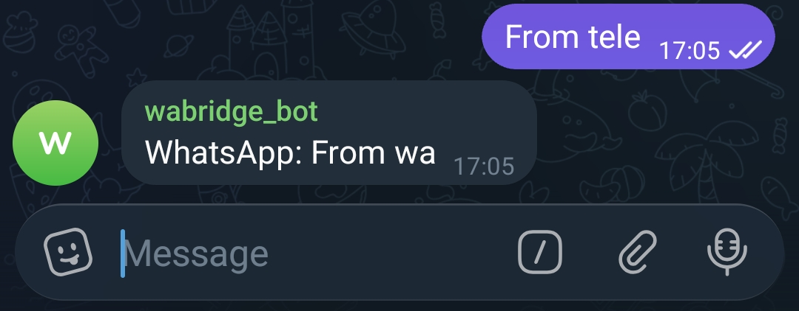
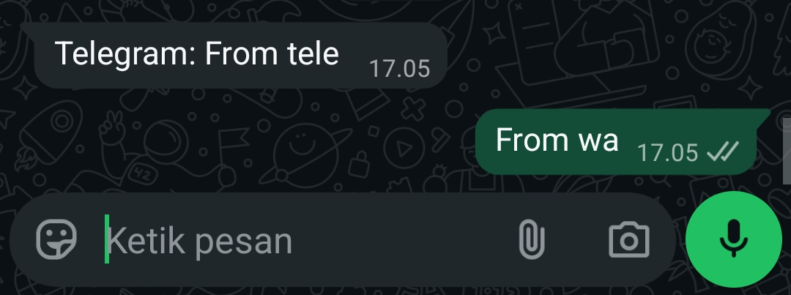

# Wagram

<br/>

A bidirectional bridge that relays messages between **Telegram** and **WhatsApp** - including text, images, videos, audio, documents, and stickers.

Built with Go using [whatsmeow](https://github.com/tulir/whatsmeow) for WhatsApp and [gotgbot](https://github.com/PaulSonOfLars/gotgbot) for Telegram.

## Screenshot
From telegram -> whatsapp



From whatsapp -> telegram



### Media Support

| Media Type | WA → TG | TG → WA | Format |
| ---------- | :-----: | :-----: | ------ |
| Image      | ✅      | ✅      | JPEG, PNG |
| Video      | ✅      | ✅      | MP4 |
| Audio      | ✅      | ✅      | OGG, voice notes |
| Document   | ✅      | ✅      | Any file (PDF, ZIP, etc.) |
| Sticker    | ✅      | ❌      | WebP |
| Caption    | ✅      | ✅      | Text attached to media |

## Getting Started

### Prerequisites

- **Go 1.25+**
- A **Telegram Bot Token** from [@BotFather](https://t.me/BotFather)
- A **WhatsApp account** to link via QR code

### Installation

```bash
git clone https://github.com/0xtbug/Wagram.git
cd Wagram
go mod download
```

### Configuration

Set the following environment variables:

| Variable             | Required | Default          | Description                        |
| -------------------- | -------- | ---------------- | ---------------------------------- |
| `TELEGRAM_BOT_TOKEN` | Yes   | —                | Telegram Bot API token             |
| `WAGRAM_DB_PATH`     | No       | `wagram.db`      | SQLite file for chat mappings      |
| `WA_SESSION_DB_PATH` | No       | `wa_session.db`  | SQLite file for WhatsApp session   |

### Run

```bash

# Make .env file
# Add environment variables to .env file
TELEGRAM_BOT_TOKEN="your-token-here"
WAGRAM_DB_PATH="wagram.db"
WA_SESSION_DB_PATH="wa_session.db"

# Or export environment variables
export TELEGRAM_BOT_TOKEN="your-token-here"
export WAGRAM_DB_PATH="wagram.db"
export WA_SESSION_DB_PATH="wa_session.db"

# Start wagram
go run ./cmd/wagram

```

## Build

```bash
go build ./cmd/wagram
```

## Bot Commands

| Command      | Description                                          |
| ------------ | ---------------------------------------------------- |
| `/start`     | Show welcome message with all available commands      |
| `/scan`      | Generate WhatsApp QR code for login                   |
| `/status`    | Check WhatsApp connection and authentication state    |
| `/bridge`    | Link a WhatsApp chat to the current Telegram chat     |
| `/unbridge`  | Remove the link for the current Telegram chat         |
| `/list`      | Show all active WA ↔ TG chat mappings                 |

## Docs
<a href="docs/How-to-use.md">How to use</a>

## Tech Stack

| Component  | Library                                                                 |
| ---------- | ----------------------------------------------------------------------- |
| WhatsApp   | [whatsmeow](https://github.com/tulir/whatsmeow)                        |
| Telegram   | [gotgbot](https://github.com/PaulSonOfLars/gotgbot)                    |
| Database   | SQLite via [go-sqlite](https://github.com/glebarez/go-sqlite)          |
| QR Code    | [go-qrcode](https://github.com/skip2/go-qrcode)                        |

## Running Tests

```bash
go test ./test/... -v
```
